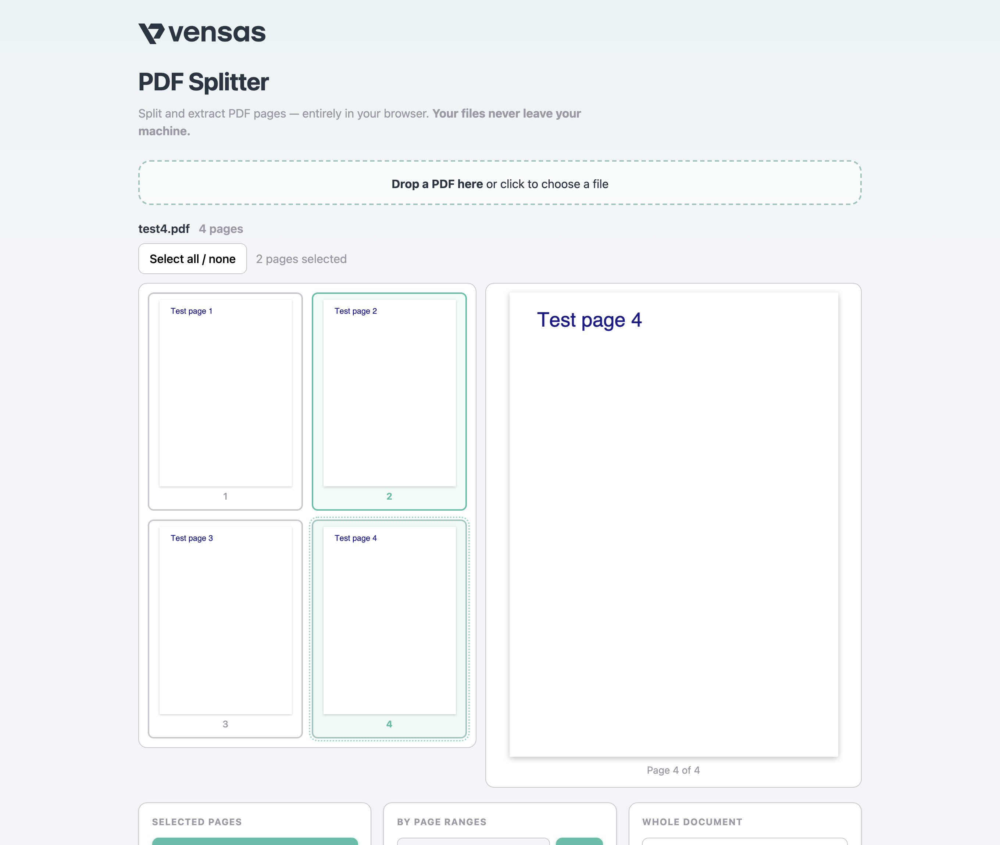

# PDF Splitter

[](https://github.com/vensas/pdf-splitter/actions/workflows/deploy.yml)
[](LICENSE)
[](https://vensas.github.io/pdf-splitter/)

A [vensas GmbH](https://www.vensas.de) product — split and extract PDF pages, **entirely in your browser**.

**➜ [Open PDF Splitter](https://vensas.github.io/pdf-splitter/)**



## Why this exists

Most online PDF splitters upload your document to a server you know nothing about.
This tool doesn't: all processing happens locally in your browser using
[pdf-lib](https://pdf-lib.js.org) and [pdf.js](https://mozilla.github.io/pdf.js/).
**Your files never leave your machine** — safe for payslips, contracts, invoices,
and anything else you'd rather not hand to a stranger's server.

## Features

- 📄 **Drag & drop** a PDF and see thumbnails of every page
- 🔍 **Large preview** — click a page to inspect it in a readable size before extracting
- ✂️ **Extract selected pages** as one PDF, or as one PDF per page in a ZIP
- 🔢 **Split by page ranges** like `1-3, 5, 8-10` — each range becomes its own PDF
- 📦 **Split the whole document** into single pages, delivered as a ZIP
- 🌓 **Light, dark, or auto theme** — toggle in the header, follows your system by default
- 🔒 **No accounts, no tracking, no uploads** — a static page served from GitHub Pages

## Usage

1. Open the [app](https://vensas.github.io/pdf-splitter/) and drop a PDF onto the page.
2. Click pages to select them — the clicked page shows up as a large preview on the right.
3. Pick an action:
   - **Extract as one PDF** — selected pages become a single document.
   - **One PDF per page (ZIP)** — each selected page becomes its own file.
   - **Split** with a range expression — `1-3, 5` produces two PDFs.
   - **Split into single pages (ZIP)** — the whole document, one file per page.

Output files are named after the source, e.g. `report_pages_2-4.pdf` or `report_split.zip`.

## Development

```bash
npm install
npm run dev            # local dev server with hot reload
npm test               # unit tests (vitest)
npm run test:coverage  # tests with coverage (80% threshold on core logic)
npm run build          # type-check (strict) + production build to dist/
npm run preview        # serve the production build locally
```

The interesting code lives in three small modules:

| Module | Responsibility |
| --- | --- |
| [`src/ranges.ts`](src/ranges.ts) | Parse and format page-range expressions (pure, fully tested) |
| [`src/split.ts`](src/split.ts) | Extract/split pages with pdf-lib (pure, fully tested) |
| [`src/thumbnails.ts`](src/thumbnails.ts) | Render page previews with pdf.js |

## Deployment

Every push to `main` runs the tests and deploys to GitHub Pages via
[`.github/workflows/deploy.yml`](.github/workflows/deploy.yml). Pull requests get the
test job only. The Vite `base` is set to `/pdf-splitter/` to match the Pages URL.

> Note: if a Pages deployment fails transiently, trigger a fresh run
> (`gh workflow run deploy.yml`) instead of re-running the failed job — a re-run
> uploads a second `github-pages` artifact into the same run, which
> `actions/deploy-pages` rejects.

Dependency updates are automated with Dependabot (weekly, Monday mornings;
minor/patch updates grouped, `vitest`/`@vitest/*` always bumped together).

## Limitations

- Very large PDFs are constrained by browser memory — typical documents are fine.
- Password-protected PDFs are not supported.

## License

[MIT](LICENSE) © vensas GmbH
